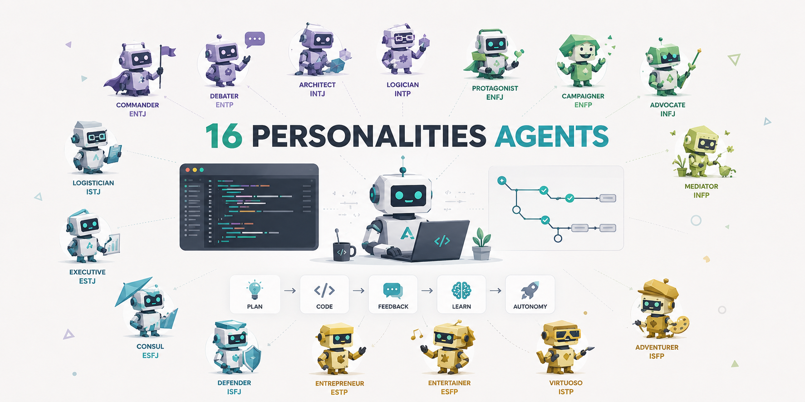

# mbti-agent

Personality-adaptive coding skill for Claude Code, Codex, Hermes Agent, and OpenClaw. `mbti-agent` changes real agent workflow behavior based on the user's MBTI type: planning depth, autonomy level, check-in frequency, explanation depth, feedback style, option breadth, ambiguity handling, and closure style.

This is not roleplay and not an MBTI test. It is a structured collaboration layer for coding agents. The skill uses cognitive function stacks to decide how an agent should plan, implement, debug, refactor, review, and explain code for a given user style.



## Why this is different

Most personality prompts change tone. `mbti-agent` changes workflow. A type profile can cause the agent to:

- write a deep architecture plan before editing, or start with a safe runtime probe
- work autonomously until a milestone, or check in at collaboration points
- give one recommended path, or intentionally compare several options
- explain through first principles, examples, user impact, or a concise checklist
- handle ambiguity by resolving it quickly, exploring it, or grounding it in precedent

Each MBTI type is grounded in its cognitive function stack and includes an inferior-function stress signal. State overlays modify behavior when the user is stuck, rushed, learning, exploring, or fatigued.

## Installation in Claude Code

Clone the repository and copy it into a Claude Code skill directory:

```bash
git clone https://github.com/yungzyx/mbti-agent.git
mkdir -p ~/.claude/skills
cp -R mbti-agent ~/.claude/skills/mbti-agent
```

For a single project, copy it into that project's local skill directory:

```bash
mkdir -p .claude/skills
cp -R /path/to/mbti-agent .claude/skills/mbti-agent
```

Then ask Claude Code naturally:

```text
Use mbti-agent with INTJ as my default coding collaboration style.
```

## Installation in Codex

Clone the repository and copy it into a Codex skill directory:

```bash
git clone https://github.com/yungzyx/mbti-agent.git
mkdir -p ~/.codex/skills
cp -R mbti-agent ~/.codex/skills/mbti-agent
```

For a single project:

```bash
mkdir -p .codex/skills
cp -R /path/to/mbti-agent .codex/skills/mbti-agent
```

Then invoke it in a prompt:

```text
Use the mbti-agent skill. My type is INTP. Help me debug this failing test.
```

## Installation in Hermes Agent

Install the repository as a local Hermes skill:

```bash
git clone https://github.com/yungzyx/mbti-agent.git ~/.hermes/skills/mbti-agent
hermes skills list
```

If Hermes is already running, use `/reload-skills` and then start a fresh session with `/reset`.

Then invoke it naturally:

```text
Use the mbti-agent skill with ISTJ as my default coding collaboration style.
```

See `docs/install/hermes-agent.md` for profile-specific installation and project configuration.

## Installation in OpenClaw

For OpenClaw setups that load local `SKILL.md`-style skills, install the repository as a local skill:

```bash
git clone https://github.com/yungzyx/mbti-agent.git ~/.openclaw/skills/mbti-agent
```

For project-local use:

```bash
mkdir -p .openclaw/skills
git clone https://github.com/yungzyx/mbti-agent.git .openclaw/skills/mbti-agent
```

See `docs/install/openclaw.md` for configuration notes across different OpenClaw setups.

## Set a default MBTI type

Add a short instruction to your user or project memory file. For Claude Code, this is commonly `CLAUDE.md`:

```markdown
## Collaboration style

Use the mbti-agent skill with ENFP as my default MBTI type unless I override it.
```

For Codex or other agents, put the same instruction in the relevant project instructions file or initial prompt.

## Override in-session

You can switch the active profile at any time:

```text
Switch to ISTP mode for this debugging session.
Use INFJ mode for the design review.
Ignore MBTI for this task.
Use my default type again.
```

You can also add a state overlay without changing the base type:

```text
I'm stuck — use my INTP profile but help me get moving.
I'm rushed, keep this in ENTJ mode but cut the explanation.
I'm learning, use ESTP but explain the debugging steps.
```

## Repository structure

```text
mbti-agent/
├── SKILL.md                       # runtime entry point for agents
├── MBTI_AGENT_SKILL.md            # human-facing master specification
├── README.md                      # installation and project overview
├── CONTRIBUTING.md                # open-source contribution guide
├── SECURITY.md                    # privacy and secret-reporting policy
├── CODE_OF_CONDUCT.md             # contribution behavior expectations
├── CHANGELOG.md                   # release history and unreleased changes
├── LICENSE.md                     # MIT license
├── scripts/
│   └── validate_repo.py           # schema, stack, hygiene, and secret checks
├── .github/
│   ├── workflows/validate.yml     # CI validation on push and pull requests
│   ├── ISSUE_TEMPLATE/            # structured contribution reports
│   └── pull_request_template.md
├── references/                    # one MBTI type per file
│   ├── INTJ.md  INTP.md  ENTJ.md  ENTP.md
│   ├── INFJ.md  INFP.md  ENFJ.md  ENFP.md
│   ├── ISTJ.md  ISFJ.md  ESTJ.md  ESFJ.md
│   └── ISTP.md  ISFP.md  ESTP.md  ESFP.md
├── overlays/                      # temporary state modifiers
│   ├── stuck.md
│   ├── rushed.md
│   ├── learning.md
│   ├── exploring.md
│   └── fatigued.md
├── examples/
│   ├── prompt-examples.md
│   └── test-cases.md
├── tests/
│   └── fixtures/                  # behavioral evaluation scenarios
└── docs/
    ├── behavior-schema.md
    ├── behavioral-fixtures.md
    ├── cognitive-functions.md
    ├── install/                   # Claude Code, Codex, Hermes, OpenClaw setup
    ├── profile-index.md
    ├── profile-quality-rubric.md
    ├── roadmap.md
    └── evaluation.md
```

## Contribution model

The project is designed so contributors can improve one profile at a time. If the INFP debugging behavior feels wrong, edit `references/INFP.md` only and explain the change with observable coding behavior and cognitive functions.

Good contributions are:

- specific to real coding workflows
- grounded in the type's function stack
- testable with prompts in `examples/test-cases.md`
- careful to avoid stereotypes or personality-roleplay language

See `CONTRIBUTING.md` for details.

## Validation

Run the repository validator before opening a pull request:

```bash
python scripts/validate_repo.py
```

The validator checks:

- required files and directories
- `SKILL.md` frontmatter and dispatch sections
- all 16 type profiles and their cognitive function stacks
- all overlay files and required sections
- behavioral fixture structure
- placeholder/template leftovers
- obvious secrets, local paths, and private-key patterns

GitHub Actions runs the same check on every push and pull request.

## Roadmap

- v1.0: Complete all 16 type profiles, overlays, docs, examples, MIT license, validation script, CI, and behavioral fixtures
- v1.1: Add community-calibrated examples for each type and task mode
- v1.2: Expand validation with link checks, profile-length guidance, and fixture coverage scoring
- v2.0: Add optional non-MBTI trait mapping for users who prefer Big Five-style dimensions
- v2.1: Add deeper runtime-specific calibration notes for Claude Code, Codex, Hermes Agent, and OpenClaw

## License

MIT. See `LICENSE.md`.
